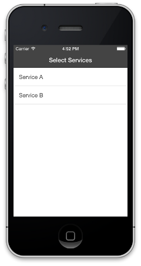
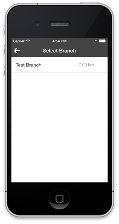
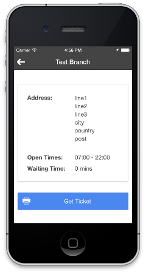
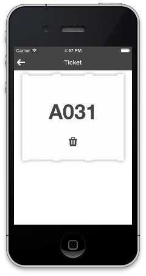
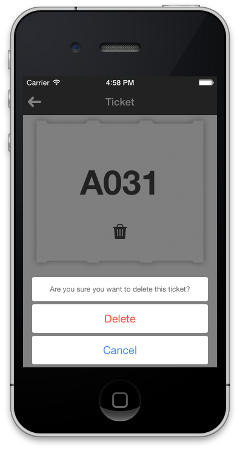

#mobile-example
Hybrid mobile app example demonstrating [Qmatic](http://www.qmatic.com) mobile API using [Ionic Framework](http://ionicframework.com/)

##Overview
A simple example that provides functionality to select a service, branch, issue and delete tickets.
Built with [Ionic Framework](http://ionicframework.com/), shows how easy it is to develop hybrid apps  
against the [Qmatic](http://www.qmatic.com) mobile extension API.

Works with the [betwixt](https://github.com/qmatic/betwixt) middleware example.

##Using
* Install the [Ionic Framework](http://ionicframework.com/)
* Clone this repo `git clone git@github.com:qmatic/mobile-example.git`
* From the repo root run the following commands:

		$ cordova platform add ios
		$ cordova plugin add org.apache.cordova.device
		$ cordova plugin add org.apache.cordova.statusbar
		$ cordova plugin add org.apache.cordova.geolocation
		$ ionic build ios
		$ ionic emulate ios

For more information see the [Ionic documentation](http://ionicframework.com/docs/)

##Screenshots

